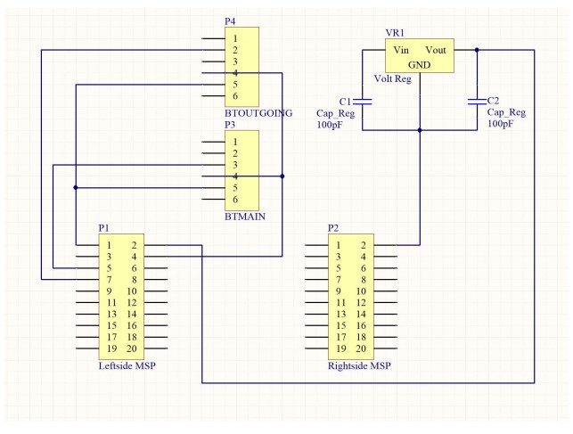

# Wireless Electric Go-Kart
Group: Adam Smrekar, Brandon Lewien, Jean-Christophe Owens, Arash Yousefzadeh  
Date: December 17th, 2017

## Introduction:
For the Embedded Systems final project, our group created an electric Go-Kart with the
use of the MSP432P401R microcontroller and BoosterPack MKII. This Electro-Kart allows a
user to sit on it and safely ride it, just like a normal Go-Kart. The difference here is that it is an all 
electric Go-Kart that uses a wireless controller instead of the usual steering wheel and pedals. One big goal
of this project was to make sure that this was safe and reliable to ride by having safety checks for the 
wireless component, a physical turn off switch, and robust hardware. We did all this by incorporating embedded 
concepts learned from class along with new concepts and circuitry design learned through research.

**This project won First Place for Fall 2017's Embedded Systems Class at University of Colorado Boulder.**

### [Video link showcasing the Electric Go-Kart](https://youtu.be/9J7c60GSMkI) 

### Images: 

## Implementation:
The following implementations were divided into two different categories. Firstly, there
is the hardware and secondly the software.

Hardware Block Diagram: [Link](https://drive.google.com/file/d/1l7-Fnbb38Op6hISRjfihspLub2xPv3wl/view)

Software Flow Diagram: [Link](https://drive.google.com/file/d/1rWAXqVIRYYwtYjQ_b6t-H40YZpuccp2R/view)

### Hardware/How the Electro-Kart works:
<ins>Description of the Circuit:</ins>

The hardware as we see below is comprised of a 12V, 18 amp-hour battery connected to
a power train (power and ground). There is a kill switch connected to the front as a safety feature
and not to exhaust the battery life. There are 40 amp fuses located behind the power train to
avoid damaging the parts if there is too much current that is being outputted. The signal sent was
from the GPIO wiring from the slave which sent the PWM (Pulse Width Modulation) waves.

The PWM wave are then sent to the two speed controllers. When the speed controllers
receive their unique PWM waves from the MSP and then change the voltage going into the
motors based on the duty cycle of the wave. The first part of the motors are two switches
connected to the speed controllers at the front of the kart. The switches reverse the polarity of the
current which in turn causes the motors to go forward or backward. The motors then spin faster
or slower based on the size of the voltage flowing into them. However, the problems with the
speed controller and varying speed is discussed in the conclusion.

In addition, we had to implement a way of doing reverse which was originally planned to
be done with relays. Unfortunately, we couldn’t get the relays to work with our circuit so we
improvised and found two DPDT switches which allowed the robot (with a flip) to move
forwards and backwards. This also allowed the robot to turn 360° demonstrating its dexterity and
1
maneuverability. The speed controller then connected the motors which allowed the motion to
act. The hardware is shown below (Figure 1).

Figure 1: Circuit of Electro-Kart

<ins>Controller - Master:</ins> Here we have the main controller of the Electro-Kart that used an MSP432P401R 
microcontroller with the BoosterPack, HC-05 Bluetooth module, custom PCB,
and a 3D printed enclosure. The MSP432 with BoosterPack incorporates the joystick as the way
of controlling the Electro-Kart. We also have a button on the BoosterPack that is used for data
analysis (More detail later on). At the software level, we divided the joystick into 9 different
sections (More details in Software). The section that the joystick is located is what is sent out. We also had a 
heartbeat function which includes a test byte that is sent to the Slave MSP to make sure that data is being sent.
 This is used for safety reasons. The joystick locations and heartbeat data is sent through UART and to the HC-05 
 Bluetooth module. This data is sent to another HC-05 Bluetooth module which is connected to an MSP432 on the Electro-Kart. 
 Also the main controller incorporates a custom PCB. The PCB layout and diagrams for the Master are shown
below:

Figure 2: Controller with Master MSP and BoosterPack

Figure 3: Master PCB Layout (Using Altium)

Figure 4: Master PCB Schematic (Using Altium)

Figure 5: Master PCB (Printed at Tim’s Lab in the ITLL of CU Boulder). There are globs of
solder because the printer did not catch the thin lines that connect the copper to the common
ground polygon pour. Connected is a working voltage regulator that is taking in a 9V battery to
output 5 volts.

<ins>MSP432 - Slave:</ins> The joystick data is received from the Master Bluetooth module to Slave HC-05 Bluetooth module. 
At the software level, the Slave module is taking the received joystick data and based off of that data, outputting the 
correct Pulse Width Modulation (PWM) waves through the circuit and to the motors. Also, there is the heartbeat byte that
 is received. If there is no heartbeat byte that is being received which indicates that there is a disconnection between 
 the Bluetooth modules, the PWM function receives a 0 which means stop the motors from running.

Figure 6: Slave PCB Layout (Using Altium)

Figure 7: Slave PCB Schematic (Using Altium)

Figure 8: Slave PCB (Printed at Tim’s Lab in the ITLL of CU Boulder). There are globs of
solder near the bluetooth devices due to a minor accident where both modules had to be
swapped. A second voltage regulator/9V battery was not necessary for the slave.

### Software:

<ins>PWM-Slave:</ins> Main Wave Generator. TIMER_A0->CCR[x] allows for different duty cycles to be 
generated that varies the output of the speed controller. TIMER_A0->CCR[1] uses P2.4, while
CCR[2] uses P2.5. This information is found in the gpio1.c file. Using enumerations for the duty
cycle readings. The enumeration function is found in timer header file. The speed controller
needs at least a 1,000 Hz Frequency in order to be read. 2,000 Hz is the max.
Retriever-Slave: Bluetooth value sorter and code feedback for bluetooth state. This function
implements a heartbeat timer where the MSP & Bluetooth Master Device sends a consistent 0xA
every 200ms. This means there should be about 4 0xA's being sent before counter == 1000. The
filtered value being returned will only return a value between 0-9, where every other value is
considered as garbage.

<ins>gpio_LEDout-Slave/Master:</ins> Different inputs for specific color combinations. This function
specifically turns specific lights on or off on the MSP (Not the Boosterpack). Bits 0, 1, 2 are
used.

<ins>UART_configure-Slave/Master:</ins> Configured at 115200 Baud Rate to match the master MSP432,
Master HC-05, and Slave HC-05.

<ins>Bluetooth_config-Slave/Master:</ins> This function uses the same AT commands that are used to
configure the HC-05 with an Arduino. Since the AT commands are sent over UART, we took
that received data over UART and used it in this function to configure the bluetooth modules. In
order to send these commands, this function needs to be called while bluetooth modules are in
AT command mode meaning the Enable pins are high and there should be a slow consistent
blinking LED.

<ins>Port3_IRQHandler-Master:</ins> General PORT3 Interrupt Handler. This function primarily deals
with a byte through UART to be sent via the bus in order to output feedback the slave MSP.
Please note that the bottom button acts funny and reads Bits 5 and 6 making 0x30 for some odd
reason. A workaround just ignores that BIT6 and does whatever it needs with P3.5.

<ins>Joystick Location-Master:</ins> Default position reads for x=8310 and for y=8140. Channelx takes an
input from main that compares values for the left and right movement. Channel-y takes an input
from main that compares values for the up and down movement. Prioritizing forward movement
on top, backwards and 180 turning on bottom. Note that the joystick is not a complete matrix of
2^14x2^14 things (including the negatives of course). There is a weird cutoff that needed to be
made specifically for Brandon's white LCD Boosterpack MKII.

<ins>Timer A0 Interrupt Handler-Master:</ins> Timer A0_0 Interrupt Handler. This function sends a byte of
0xA every 200ms based off of the configuration above.

## Results:

For data analysis, we used another HC-05 module on the slave which could be connected
by any other device like a computer or a phone. Figures 9-12 shows the data sent out from the
slave and their descriptions. All of this is displayed through RealTerm.

Figure 9: A continuous output is being sent via bluetooth to the serial terminal to warn the user 
that there is no bluetooth connection.

Figure 10: Outputs of the Joystick Quadrants from the Slave MSP to the Master MSP. 
This information is being read and outputted via bluetooth to any bluetooth serial terminal.

Figure 11: Outputs with a press of the bottom button on the boosterpack from the master. This serves as a ‘ping’ from master to slave which is being read on the serial terminal via bluetooth.

Figure 12: Outputs with a press of the reset button on the slave MSP. There is an easter egg that is displayed.

## Future Ideas and Comments:

The world is transforming technologically, there are more AI development with the aid of
virtual or augmented reality. This would certainly be a great prototype for a defense contractors. 
Due to its specifications of remote capabilities and nature of cost (very low), this project could 
be mass produced and more efficient. A future addition to this robot would be the implementations 
of “VIVE” drivability. This would include a Pixy-Cam that would stream
footage at the front of the chassis. Then processes to a vive that can be driven with a reality
headset and be mobile. Controlling and viewing first person would escalate the drone industry
defensively and commercially.

## Conclusion:

The Electrokart features full functioning omnidirectional capabilities and extensive
firmware/ software. Using Bluetooth modules connected via UART (Universal asynchronous
receiver transmitter) allow the master and slave to communicate. The master is comprised as the
wireless remote control with the joystick conducting the direction. The slave is used to register the 
values from the master and output PWM (Pulse width modulation) waves to the speed
controller. Once the speed controller reads the frequency and duty cycle of the PWM waves, it
transfers the chirp to the motors. In order to log data, another Bluetooth module was connected
on the slave and through UART is transferred to RealTerm in order to show if the connection
was successful.

The circuitry of the Electrokart includes crucial elements for it to function. The battery
was the hardest to gauge, it was outputting 12 volts with 18 Amp-hours. When connecting the
battery to the circuit, a power train for power and ground connected the fuses which were
attached to the speed controller (in case it blew or shorted). The speed controller was connected to 
polarity switches which means that when the cart moved forwards we could reverse the direction by 
flipping the switches.

To make this project work, we first spent 2 weeks planning and researching the parts and
how to incorporate them. Originally, this was supposed to be a robot, but did not find that it was 
applicable or really had a purpose so we iterated on the design and made a electric Go-Kart. We went 
through this project step-by-step by trying to get one motor to work with the power supplies from 
the lab along with making joystick to work with our code. Then, gradually through a lot of time and trial 
and error, we solved each problem one at a time which eventually resulted in our final product. We tried 
spending as much time early including the first day of Fall break to make sure we had enough time 
to account for any problems we would encounter when the deadline was approaching. In the end, we did 
have enough time and we were able to make the electric Go-Kart aesthetically pleasing and presentable.

The electric Go-Kart was a working success. However, there were problems that were
encountered during the process. The first major problem was power output through the speed
controller to the motors. With a strict power regulation input for the speed controller, the
resistance changes due to the change in duty cycles were consequential to work with. Plugging
the motor straight to a power supply (12V/12A max) allowed the motor to freely spin, pulling a
max of 12V and 8-9A. However, with the addition of the Vector 884 Speed Controller, a
12V/.1A was only being pushed. With a literal kick to the wheel, the motors were able to freely
move at a constant speed pulling the same 12V-8-9A. One of the major problems discovered
here was the motor first needed a spike in power in order to start. This is due to the extra torque 
needed at the beginning, while less of a torque is required when spinning.

Multiple ideas were implemented to fix this problem. First, having an inductor/capacitor
combination was implemented as an idea to offset the output slightly in order to give a kick to
the motor. A second idea was to put a large enough capacitor in parallel with the speed controller 
output to give the initial power needed to start the motor. The third idea was similar to the second 
which implemented the same capacitor but before the speed controller. The fourth idea was to change 
the calibration settings within the speed controller with varying frequencies being outputted (since 
the speed controller has a built in relay to reverse polarities of the motor). The final implementation
 was to buy a battery large enough to output 12V and at least 18A (for the two motors). This last idea 
 worked by buying a lead battery (12V/20Ah/200 cold cranking Amps), however, this issued another problem.

The second discovered problem is the speed controller can not regulate a high current.
Without regulation, duty cycles are useless to this project as a 5% duty cycle does not have
enough power to kickstart the motor, but going from a 95% duty cycle down to 5% does not
change the output speed.

Again, multiple methods were implemented to solve this problem. First, downscaling the
project to a smaller 6V/1.5A motor proved our theory correctly with a prototype. The speed
controller allowed for different duty cycles to change the rotation speed and sound of the motor. 
With this, we bought a 12V/18Ah battery that matched the specifications of the initial battery that 
we had to start the project. This new battery only allowed for a smaller torque and slower speeds when 
tested, but not a varied speed. With a deadline approaching, we ran with the idea and did actual test 
outside. We knew we couldn’t vary the speeds, but could only turn the motors on or off (together and 
separately). This means that to turn left, the right motor has to be on full power while the second 
one off, and vice versa for right. Even with a lack of variable speed, the motor turned without stutter
 and still allowed for the user to have complete control of the vehicle.

Besides power, bluetooth was a major stepping stone for the group. Safety was stressed
for this project, and losing control of a robot because of missent/misread information, disconnect
issues, etc. was a consistent problem. Like said above, a heartbeat timer was implemented for a
specific reason. When sending data through bluetooth, there is always a consistent ASCII square
wave being transmitted from the Master to the Slave MSP. If pairing was cut between the two
devices, a consistent 3.3V would be sent. Because this straight line cannot be read as an ASCII
value, the current holder within the bluetooth receive function cannot update the value to NULL.
This resulted in the problem in if ‘Full Speed’ was being sent and a disconnect happened, the
user would lose control of the vehicle, turning it into a full ‘autopilot full speed ahead’ Go-Kart. 
In turn, sending a consistent 0xA value for a given time allows for the slave MSP to know that the
 other MSP is still alive, which we called the heartbeat timer. This idea is seen throughout many 
 communication devices, even in the MSP432 as the Watchdog Timer.

A minor problem was receiving garbage data from time to time. This is solved by fixing
the configuration of bluetooths and UART for MSP’s to all transmit at the same baud rate.
However, a safety measure had to be implemented. We sorted specific numbers out and
considered them garbage when receiving. A checksum function was being implemented as an
additional safety check but never completed due to hardware faults. With this function and
hardware implementation, we could have accurately known if we were receiving non-garbage
data and/or having an encoder to see if we were spinning at the same speed for both wheels.

We originally had LCD configured which worked as advertised. However, this was
removed since the speed of the data being transmission was heavily affected. There are specific
changes that TI made in order to speed up the frames per second that the LCD could output at.
While disabling the clock and frequency changes that TI implemented, the output data still was
too fast which a huge delay for every output. In turn, the idea was scrapped.

We achieved our goals at the end of the day. With a safe and reliable Electric Go-Kart
that was tested going down the path from the Engineering Center to Fleming and back, the
Electric Go-Kart had no problems turning, going straight, and so forth. There are of course new
design implementations that could always be added, but for now, we all are happy with the
outcome of this project.

Overall, this project was really stressful. Being able to do a project as ambitious as we
originally planned (which included more than the actual) and aiming for the first prize was a lot 
to do in 5 weeks. We took barely any breaks, stayed up till 4 am consistently, and skipped class to 
get this to work. It was a really good learning experience overall and we learned a lot through this 
Electro-Kart. Now, time to fix our sleep schedule

### Appendix:

Bill of Materials:
- 12V Battery/20Ah - $35
- 3x PCB, Voltage Regulator Components, Wires - $20
- 3x Bluetooth HC-05 Modules - $25
- 2x MSP432P401R - $22
- MSP432 BoosterPack Mark II - $40
- 2x DPDT, SPST Switches - $15
- 10x Bandages - $1
- Wood/Plasterboard - 40$
- Metal Frame - 100$
- Robot Components - <500$
- ***Disclaimer: We already had most of the expensive parts***